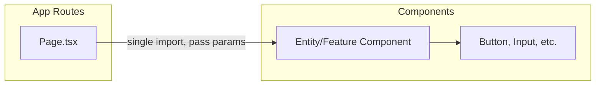

# Ice Cream Online Store – Refactoring Plan

This plan is a **to-do list** to be executed **one action after another**. Each item is a discrete task to perform later.

---

## Completed (Category 1 – API)

- **1.1** Unused API routes removed: `api/categories/[id]`, `api/categories/[id]/products`, `api/categories/[id]/products/order`, `api/images/index`, `api/images/update-index`, `api/products/by-sale`, `api/storage/unplaced-products`. Category API is now **name-based only** (1.2).
- **1.3** Centralized API client added: `src/lib/api/client.ts` with `api`, `apiGet`, `apiPost`, `apiPatch`, `apiPut`, `apiDelete`. All client-side `fetch('/api/...')` call sites have been migrated to use it. Server-side fetch (e.g. in `MainMenu`, `ProductsByCategory`, search page) still use absolute URLs and were left as-is.

---

## Current state (summary)

- **58 API route files** under `src/app/api`; **7 are unused** (no `fetch`/useSWR references).
- **Pages**: Almost all are thin wrappers around a single component from `@/components/*`; one exception is `src/app/(root)/(cms)/orders/[id]/address/page.tsx`, which holds logic, fetch, and a raw `<button>` instead of the shared CMS `Button`.
- **Components**: ~79 files under `src/components`. Structure is `store/`, `cms/` (with `ui/`, `shared/`, `sections/`, `entities/<entity>/`). Inconsistencies: mixed file naming (kebab-case vs PascalCase), redundant `cms/entities/category/ui/ui/` folder, two different `SaleGroupCard` implementations, two different `ImageGrid` implementations, and mixed modal patterns (reusable components vs inline dialogs).
- **One page** is `.jsx` (`src/app/(root)/(cms)/categories/new/page.jsx`); the rest are `.tsx`.

---

## Category 1: API cleanup and consolidation

**Goal:** Remove or document unused endpoints; reduce duplication between id-based and name-based category APIs.

| #   | Action                                                   | Details                                                                                                                                                                                                                                                                                                                                                                                             |
| --- | -------------------------------------------------------- | --------------------------------------------------------------------------------------------------------------------------------------------------------------------------------------------------------------------------------------------------------------------------------------------------------------------------------------------------------------------------------------------------- |
| 1.1 | **Remove or document unused API routes**                 | Unused routes (no references in app): `api/categories/[id]`, `api/categories/[id]/products`, `api/categories/[id]/products/order`, `api/images/index`, `api/images/update-index`, `api/products/by-sale`, `api/storage/unplaced-products`. Either delete the route files and any route-only helpers, or add a short comment/doc and mark as deprecated if they are needed for scripts/external use. |
| 1.2 | **Decide category API strategy**                         | The app uses **name-based** category APIs everywhere (`/api/categories/name/[name]`, …). The **id-based** routes are unused. Either: (A) Remove id-based category routes as part of 1.1, or (B) Migrate one or two call sites to id-based and then remove name-based to avoid maintaining two parallel APIs. Document the decision.                                                                 |
| 1.3 | **Optional: centralize API base URL and fetch behavior** | All calls use raw `fetch('/api/...')`. Consider introducing a small `src/lib/api/client.ts` (or similar) that wraps `fetch` with base URL, default headers, and optional auth/error handling, then migrate call sites in batches. This is optional and can be a later phase.                                                                                                                        |

---

## Category 2: Pages – thin-wrapper consistency and file format

**Goal:** Every page is a thin wrapper that delegates to `@/components/*`; use shared UI primitives; single file extension.

| #   | Action                                          | Details                                                                                                                                                                                                                                                                                                                                  |
| --- | ----------------------------------------------- | ---------------------------------------------------------------------------------------------------------------------------------------------------------------------------------------------------------------------------------------------------------------------------------------------------------------------------------------- |
| 2.1 | **Refactor order address page to thin wrapper** | Move logic and UI from `src/app/(root)/(cms)/orders/[id]/address/page.tsx` into a new component (e.g. `src/components/cms/entities/fulfillment/order-address-form.tsx` or `address-form.tsx`). Page should only import that component and pass `params`/`searchParams` as needed. |
| 2.2 | **Use shared Button on order address screen**   | In the new order-address component (or current page if 2.1 is done in one step), replace the raw `<button className="...">` with `Button` from `@/components/cms/ui/button`.                                                                                                                                                             |
| 2.3 | **Normalize page file extension to .tsx**       | Rename `src/app/(root)/(cms)/categories/new/page.jsx` to `page.tsx` and add types if needed. Update any references.                                                                                                                                                                                                                      |

---

## Category 3: Component structure and naming

**Goal:** Consistent file naming, clear folder structure, no redundant nesting.

| #   | Action                                                 | Details                                                                                                                                                                                                                                                                            |
| --- | ------------------------------------------------------ | ---------------------------------------------------------------------------------------------------------------------------------------------------------------------------------------------------------------------------------------------------------------------------------- |
| 3.1 | **Standardize component file naming**                  | Choose one convention (recommended: **kebab-case** for all component files). Rename `AddressSearch.tsx` → `address-search.tsx` and `AddressDisplay.tsx` (in fulfillment/ui) → `address-display.tsx`; update all imports.                                                           |
| 3.2 | **Remove redundant `ui/ui` folder**                    | Move `src/components/cms/entities/category/ui/ui/sale-group-card.tsx` up to `src/components/cms/entities/category/ui/sale-group-card.tsx` (or a distinct name if kept alongside another card—see 4.1). Delete the inner `ui` folder. Update imports (e.g. in `view-products.tsx`). |
| 3.3 | **Optional: add barrel exports for shared primitives** | Add `src/components/cms/ui/index.ts` (and optionally `store` if you add store primitives) re-exporting `Button`, `Input`, `Label`, `Select`, `toast`, etc., so imports can use `@/components/cms/ui` instead of per-file paths. Migrate imports gradually.                         |

---

## Category 4: Component duplication and naming clarity

**Goal:** Avoid two components with the same name but different contracts; clarify or unify modal/dialog usage.

| #   | Action                                                   | Details                                                                                                                                                                                                                                                                                                                                                           |
| --- | -------------------------------------------------------- | ----------------------------------------------------------------------------------------------------------------------------------------------------------------------------------------------------------------------------------------------------------------------------------------------------------------------------------------------------------------- |
| 4.1 | **Rename category SaleGroupCard to avoid collision**     | The category entity has a different `SaleGroupCard` (group with products, used in view-products) than the sale-group entity's `SaleGroupCard` (link card in list). Rename the category one to e.g. `CategorySaleGroupCard` or `SaleGroupProductCard`, and use that name for the file and export. Update imports in `view-products.tsx` and any other category UI. |
| 4.2 | **Rename one or both ImageGrid components**              | Product images: `cms/entities/product/images/ui/image-grid.tsx`; image entity: `cms/entities/image/ui/image-grid.tsx`. Rename to distinct names (e.g. `ProductImageGrid` and `ImageLibraryGrid`) and update imports so it's clear which grid is used where.                                                                                                       |
| 4.3 | **Introduce a shared Modal/Dialog primitive (optional)** | Today modals are implemented ad hoc in several places (e.g. fulfillment view, cart, image-picker-panel). Optionally add a single reusable component (e.g. `src/components/cms/ui/dialog.tsx` or `modal.tsx`) with accessibility (aria-modal, focus trap) and refactor one or two high-traffic flows first; then migrate others over time.                         |

---

## Category 5: Documentation and conventions

**Goal:** Document patterns so future work stays consistent.

| #   | Action                           | Details                                                                                                                                                                                                                                                |
| --- | -------------------------------- | ------------------------------------------------------------------------------------------------------------------------------------------------------------------------------------------------------------------------------------------------------ |
| 5.1 | **Document "thin page" rule**    | In `docs/` or `.cursor/rules`, state that app route pages under `src/app` should only compose components from `@/components` and pass route params; no business logic or heavy JSX in page files. Point to the order address refactor as the template. |
| 5.2 | **Document component structure** | Short doc: `store/` for storefront, `cms/` for admin; under `cms/`, `ui/` = primitives, `entities/<name>/` = entity-specific with optional `ui/` subfolder; file names kebab-case.                                                                     |
| 5.3 | **Document API usage**           | List which API routes are public vs protected; note that category APIs are name-based (and id-based removed or deprecated). If you add a small API client (1.3), document its usage.                                                                   |

---

## Category 6: Optional follow-ups (lower priority)

- **Store UI primitives:** If the store gains more forms/buttons, consider a small `src/components/store/ui/` with shared Button/Link styles so store and cms don't drift.
- **Data fetching:** If you add an API client (1.3), consider a single `useApi` or fetch helper used by both store and cms for consistency and error handling.
- **Testing:** Add a few tests for critical API routes or key components after the refactors settle.

---

## Execution order suggestion

Execute in order within each category; categories can be reordered by priority:

1. **Category 1** (API) – 1.1, then 1.2; 1.3 later if desired.
2. **Category 2** (Pages) – 2.1 and 2.2 together for the address page; then 2.3.
3. **Category 3** (Structure) – 3.1, 3.2; 3.3 when convenient.
4. **Category 4** (Duplication) – 4.1, 4.2; 4.3 when you want a shared modal.
5. **Category 5** (Docs) – 5.1 after 2.1/2.2; 5.2 and 5.3 anytime.

---

## Diagram: Target page vs component flow

After refactor: every page is like `P`; logic and form UI live in `C`; shared primitives in `U`.
